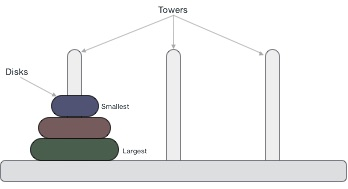
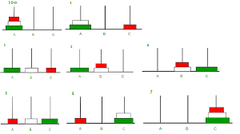

# 🗼 Tower of Hanoi - BFS Solver

**Summary:**  
This repository contains a Python implementation of the classic **Tower of Hanoi** puzzle using a **Breadth-First Search (BFS)** algorithm. Unlike the traditional recursive approach, this solution uses iterative graph traversal to ensure the shortest sequence of valid moves to solve the puzzle. It's a useful educational tool for understanding state-space search algorithms and comparing them with recursive methods.

---


Table of Contents

- [Problem Description](#-problem-description)
- [Why Use BFS?](#-why-use-bfs)
- [How It Works](#-how-it-works)
- [File Structure](#-file-structure)
- [How to Run](#️-how-to-run)
- [Example Output](#-example-output-n--3)
- [References](#-references)
---

## Problem Description
<details>
The **Tower of Hanoi** is a mathematical puzzle involving:

- **Three rods (pegs)**.
- **Multiple disks** of different sizes, stacked in decreasing size on the source rod.
- The goal is to move the entire stack to the target rod following these rules:

1. Only one disk can be moved at a time.
2. Only the top disk from a rod can be moved.
3. No disk may be placed on top of a smaller disk.

While traditionally solved using recursion, this project explores solving the puzzle **iteratively using the BFS algorithm**, ensuring the minimal number of moves.
</details>

---

## Why Use BFS?

<details>

Using **Breadth-First Search** provides several benefits:

- **Guaranteed shortest solution**: BFS finds the optimal number of moves.
- **Systematic exploration**: Explores all possible states level-by-level.
- **Avoids recursion pitfalls**: Prevents stack overflow issues in large instances.

This approach highlights an **alternative to the recursive solution**, allowing deeper insight into the state transitions of the puzzle.
</details>

---

## How It Works

Each state of the puzzle is a tuple of three stacks representing rods. BFS is used to:

1. Start with the initial configuration.
2. Generate legal moves between rods.
3. Track visited states to prevent loops.
4. Halt when the goal state is found.

The solution path is then reconstructed from the visited state map.



---

## File Structure

```bash
.
├── hanoi_tower.py   # Main script implementing BFS-based Hanoi solver
├── hanoi_tower_graph.py   # Main script implementing BFS-based Hanoi solver with a graph visualization
````

---

## How to Run

Requires Python 3.

```bash
python3 hanoi_tower.py
```

The script uses a default number of disks (modifiable in the code), prints the total number of steps, and shows each move to solve the puzzle.

---

## Example Output (n = 3)

```text
Initial State: ([3, 2, 1], [], [])
Goal State: ([], [], [3, 2, 1])
Number of steps: 7

Moves:
Move disk 1 from rod 0 to rod 2
Move disk 2 from rod 0 to rod 1
Move disk 1 from rod 2 to rod 1
Move disk 3 from rod 0 to rod 2
Move disk 1 from rod 1 to rod 0
Move disk 2 from rod 1 to rod 2
Move disk 1 from rod 0 to rod 2
```

---

## References

* [Panda - Torre de Hanói (em português)](https://panda.ime.usp.br/panda/static/pythonds_pt/04-Recursao/09-hanoi.html)
* [GeeksforGeeks - Depth First Search](https://www.geeksforgeeks.org/depth-first-search-or-dfs-for-a-graph/)
* [YouTube - In-depth explanation of the Tower of Hanoi](https://www.youtube.com/watch?v=rf6uf3jNjbo)

---


